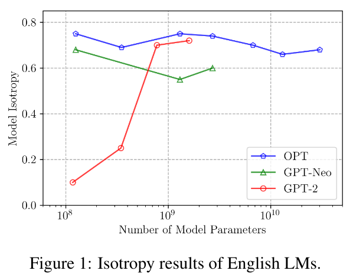

<h4>TL;DR</h4>

* <u>**GPT-NeoX-20B appears to be anisotropic**</u> (Isotropy: 0.197)
* Int8 quantisation appears to have ~no effect on isotropy 
* I am new to ML so the above could be false, feel free to poke at my findings [here](https://github.com/152334H/Contrastive_Search_Is_What_You_Need/tree/main/isotropy_analysis)

<!--more-->

# Evaluating the isotropy of more language models
In [_Contrastive Search Is What You Need For Neural Text Generation_](https://arxiv.org/abs/2210.14140), it is argued that 

> through extensive evaluations on a wide range of LMs with different scales, we empirically show that the English autoregressive LMs are naturally isotropic,

<p align="center">

<p align="center" style="color:grey">They also show a cool graph representing this finding</p>
</p>

Do I have any idea what that means? _Nope._ I know that it makes [contrastive search](https://huggingface.co/blog/introducing-csearch) useful, but I don't grasp any of the mathematics.

What I did find out: the evaluation harness for isotropy used in the paper is [open source](https://github.com/yxuansu/Contrastive_Search_Is_What_You_Need/tree/main/isotropy_analysis) and very easy to install! So I decided to try running it on a few models that were absent in the paper.

## GPT-J-6B
I'm already working on a [project](https://github.com/152334H/gpt-j-editor) with GPT-J, so I started with it.

Getting the isotropy evaluation code installed is simple.


#### Setup conda env
```bash
conda create -n csearch python=3.9
conda activate csearch
conda install pytorch torchvision torchaudio pytorch-cuda=11.7 -c pytorch -c nvidia
pip install simctg
```
#### Clone repo & extract dataset
```bash
git clone https://github.com/yxuansu/Contrastive_Search_Is_What_You_Need
cd Contrastive_Search_Is_What_You_Need/data
unzip wit.zip
```
#### Add code for new GPT model
After getting the evaluation code installed, I edited the code to work for GPT-J, as shown in [this commit](https://github.com/152334H/Contrastive_Search_Is_What_You_Need/commit/f1d609201aff2936a4fd56f12a22ed27b5633a34).

```diff
diff --git a/isotropy_analysis/compute_language_model_isotropy.py b/isotropy_analysis/compute_language_model_isotropy.py
index 44b6ed1..6c83641 100644
--- a/isotropy_analysis/compute_language_model_isotropy.py
+++ b/isotropy_analysis/compute_language_model_isotropy.py
@@ -25,7 +25,7 @@ def parse_text(text, tokenizer, max_len, bos_token_id=None):
+    if 'gpt-neo' in model_name or 'gpt-j' in model_name:
-    if 'gpt-neo' in model_name:
@@ -63,24 +63,12 @@ if __name__ == '__main__':
+    elif 'gpt-j' in model_name:
+        print('Evaluating GPT-J model')
+        from transformers import GPTJForCausalLM, AutoTokenizer
+        model = GPTJForCausalLM.from_pretrained(model_name, revision="float16", torch_dtype=torch.float16, low_cpu_mem_usage=True)
+        tokenizer = AutoTokenizer.from_pretrained(model_name)
+        bos_token_id = None
```


Result:
```sh
$ ./inference.sh
Evaluating GPT-J model
Model loaded!
Loading data...
Data loaded!
Performing inference...
100% |#######################################################|
Inference completed!
Language Code:en, Model:EleutherAI/gpt-j-6B, Isotropy:0.69
```
`0.69` is about what you'd expect from the paper, no surprise there.

## GPT-NeoX-20B
My hardware setup is limited to an RTX 3090, so the only way I can run NeoX-20B (without more money) is to load it with [LLM.int8()](https://huggingface.co/blog/hf-bitsandbytes-integration).

I eventually achieve that after some debugging:


Working from [the same commit](https://github.com/152334H/Contrastive_Search_Is_What_You_Need/commit/f1d609201aff2936a4fd56f12a22ed27b5633a34), I get a strange result:
```sh
$ ./inference.sh
Evaluating GPT-NeoX model
Model loaded!
Loading data...
Data loaded!
Performing inference...
100% |#######################################################|
Inference completed!
Language Code:en, Model:EleutherAI/gpt-j-6B, Isotropy:nan
```
`nan`. The bane of Machine Learning. I'm 99% certain this is wrong in some way, so I add print statements everywhere.

Eventually, I notice that the `last_hidden_states` of the model's forward pass looks like this:

```bash
tensor([[[nan, nan, nan,  ..., nan, nan, nan],                                                             |
         [nan, nan, nan,  ..., nan, nan, nan],
         [nan, nan, nan,  ..., nan, nan, nan],
         [nan, nan, nan,  ..., nan, nan, nan],
         [nan, nan, nan,  ..., nan, nan, nan],
         [nan, nan, nan,  ..., nan, nan, nan]]], device='cuda:0',
       dtype=torch.float16)
```

And that if I call the model right after `model.eval()`, I get this:
```bash
tensor([[[-0.1514,  1.2617, -0.0116,  ..., -0.1769, -1.2178,  0.0608],
         [-0.8823, -0.5493, -0.0648,  ...,  0.1132, -3.9043,  0.0745],
         [ 0.6362,  0.8086,  0.0204,  ...,  0.0682, -5.6445,  0.2147],
         [-0.1072,  1.6904, -1.4424,  ...,  0.1148,  0.1061, -1.3096]]],
       device='cuda:0', dtype=torch.float16, grad_fn=<NativeLayerNormBackward0>)
```

Eventually, I figure out the [line of code](https://github.com/152334H/Contrastive_Search_Is_What_You_Need/blob/f1d609201aff2936a4fd56f12a22ed27b5633a34/isotropy_analysis/compute_language_model_isotropy.py#L92) that's responsible:
```python
    if cuda_available:
        model = model.cuda(device) # model() produces NaN tensor after this line
```
The model is initialised with `device_map='auto'`, which puts the model on `device='cuda:0'` on my machine, which should be equivalent to the `device` in the above line.

**I do not understand** why the above line causes everything to go to `nan`, but I also do not think it is related to the result later on, because this problem occurs in other models (e.g. GPT-J-6B) as well.

I'm leaving this information here in case I happen to be wrong.



```bash
$ ./inference.sh
Evaluating EleutherAI/gpt-neox-20b
Model loaded!
Loading data...
Data loaded!
Performing inference...
100% |##############################################|
Inference completed!
Language Code:en, Model:EleutherAI/gpt-neox-20b, Isotropy:0.1973011465713972
```

And this is the reason why I bothered to write this post at all. **8bit GPT-NeoX-20B**, as evaluated on my machine, appears to be **anisotropic**.

## Is Int8 the problem?

Probably not.

<p align="center">

</p>

I tested int8 quantisised vs fp16/fp32 models, and got mostly identical results.

I can't rule out the possibility that my code/hardware is broken specifically for NeoX-20B, but I think the experiments I've done are strong indicators that bugged code is probably not the cause of the observed anisotropy.

