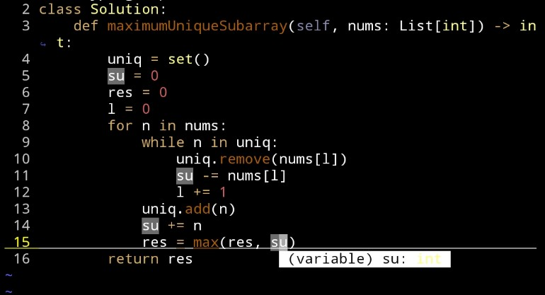

Back when 2019's [Advent of Code](https://adventofcode.com) was going on, I started a habit of what I now call `phonecoding` -- the act of programming using a run-of-the-mill Android smartphone.

<!--more-->

Phonecoding will always be incredibly inefficient compared with desktop programming, but there's a good amount of low-hanging fruit to make the experience merely _reasonably slow_, as opposed to one-character-per-second slow.

## Code editor
Phonecoders generally have three options when it comes to code editing:
1. Make use of a dedicated programming app, like Dcoder
2. Use an online webapp for programming, like repl.it, github.dev, or `code-server`
    
3. Terminal-based code editors via [Termux](https://github.com/termux/termux-app)

Option 1 is generally pretty bad. All the big name IDEs don't have mobile support, and the smaller competitors available in the app store are, generally speaking, disappointments compared to the kind of tooling available to normal programmers. They're not as bad if you're looking for a codecademy-like beginner's learn-to-code experience, but that's not a part of my agenda.

It's also difficult to do certain kinds of programming natively on a phone -- some libraries won't compile for ARM, ramping [security restrctions](https://github.com/termux/termux-app/issues/2366) for smartphones pose issues, and big datasets/packages are *really* bad to handle over mobile data.

If you happen to have a personal remote server, options 2 and 3 are both pretty good. `code-server` is almost about as good as vscode itself, if you can ignore the strain of using the UI in portrait mode. But because I'm a vim user, I went with Termux. I have a nice remote linux box to work with over ssh (courtesy of [@IRS-Cybersec](https://github.com/IRS-Cybersec)), and the rest of this post describes how I make use of it.

## nvim setup
I'm not a strong vim user. Although I started using it in 2017, I only discovered 
* how to jump to the top/bottom of a file (`gg/G`) in 2019
* that `.vimrc` exists in 2020
* how to select the contents of parentheses (`vi(`) in 2021
* the plugin system, and all the nicessities (`coc`, `ale`, `copilot`, etc) that come with it, in 2022


So, I'm really bad at the whole, "make each keystroke as powerful as possible", thing. But that's **exactly** what you need to do, as a phonecoder. It might be easy enough to type `xi()<ESC>P` on a computer, but on a phone, that might take a full five seconds for something that's as cognitively simple as "add a pair of brackets here". As [danluu](https://danluu.com/productivity-velocity/) puts:
> But editing code costs more than just the time spent typing! Programming is highly dependent on short-term memory. Every pause to edit is a distraction where you can forget the details that you're juggling. Slower editing effectively weakens your short-term memory, which reduces effectiveness.

And the length of every pause is doubled when you're on a touchscreen. On the table of optimisation vs time wasted:

Phonecoding brings you down by one step on the `How much time you shave off` axis. And this made for a really really great excuse to learn how to use neovim properly.

The process of doing just that is left as an exercise to the reader.

## Project choice
This might not be a choice available to you, but if at all possible, you should choose to write programs that require the least number of characters, and the most amount of codeless thinking.

Pictured: average Leetcode solution with <code><a href="https://github.com/clearloop/leetcode-cli">leetcode-cli</a></code>

Leetcode/Algorithm/Competitive programming problems are generally the easiest kind of code to write on a phone. It isn't Enterprise:tm: code, so you can forgo comments and long variable names and any amount of work into making your program readable by other humans. It's also heavy on mental work and light on actual typing, and the problems are mostly small enough to be reasonably accomplished in a single phonecoding session.

Web development is somewhat harder. Phone browsers generally don't come with the dev console built in, and while [Eruda](https://github.com/liriliri/eruda) is pretty awesome, it's not a full replacement. Javascript is not a particularly terse language, and that goes for double if you're using TypeScript. HTML/CSS are highly verbose, and extremely painful to type with a touchscreen. But on the plus side, any website you make will be tested on a real phone from day 1 of development.


The most painful thing I've ever tried to do on a phone is CTF pwns. IDA Pro is a GUI program, so I had to make use of ghidra's [analyzeHeadless](https://github.com/NationalSecurityAgency/ghidra/blob/master/Ghidra/RuntimeScripts/Linux/support/analyzeHeadless) script to get C pseudocode, and even then it was remarkable how much I missed the GUI. Debugger tools like [GEF](https://hugsy.github.io/gef/) are all designed to operate with substantial screen width, and I often had to flip to landscape mode just to copy a line of hex. And of course none of the libraries or binaries I use would run on an ARM phone.

So, the choice of what you're working on matters a lot.
 
## But Hardware is Still King
I've put in an awful lot of effort into making phonecoding work -- this blogpost is proof enough. But all of this work almost an avoidance of the real problem: I Should Not Be Programming With A Smartphone. There is only so much you can do to mitigate the consequences of the larger issue, which is that _programming with two thumbs on a touchscreen will always be slow_ compared with typing on a real keyboard.

So... what if we just solved that?


If you can't afford/use a laptop but have some money to spare, then the greatest and fastest optimisation to make as a phonecoder is to simply _get a real keyboard_. Everything else I've mentioned in this article will not provide the same ROI as this one decision can.

I bought the keyboard above because it was the first one I found online, but anything will work. There are of course far better keyboards available with more ergonomic designs, but the only part that's really necessary is its compatibility with your phone.

## In conclusion
1. Don't use a phone for programming
2. Failing (1), use a physical keyboard with your phone
3. Failing (2), learn how to make your keystrokes count
