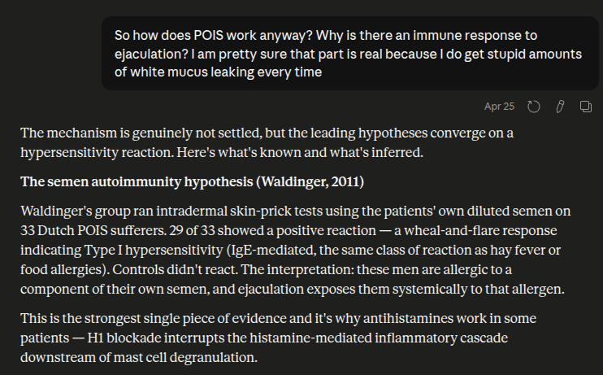
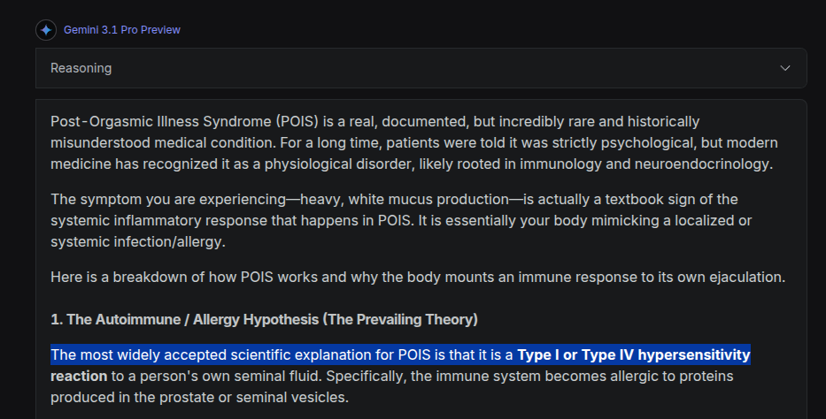

[Post Orgasmic Illness Syndrome](https://en.wikipedia.org/wiki/Postorgasmic_illness_syndrome) (**POIS**) is, allegedly, a [Rare Sexual Disorder](https://www.nature.com/collections/ahcfiaifde) whose sufferers experience some combination of [flu/fever/fatigue/irritability/aphasia/...](https://tau.amegroups.org/article/view/11107/html#five-preliminary-criteria) rapidly after any orgasm.

<!--more-->


This is an incomplete post. Where content is missing, a `TODO` is included.

**This draft is also available [on LessWrong](https://www.lesswrong.com/posts/Fs8sDiWiTbvHbJsfs/notes-on-pois).** In fact its CSS is preferable and I recommend reading this there.


To my own personal understanding,

1. the autoimmune hypothesis for POIS should be considered disproven
2. `TODO`

## Brief History

The nomenclature of POIS was introduced by [two case studies](https://pubmed.ncbi.nlm.nih.gov/11995603/) (Waldinger et al, 2002). Almost no studies are published for [the next 8 years](https://poiscenter.com/forums/index.php?topic=3127.0#:~:text=Please%20report%20dead%20links).

A decade later, [a study of n=45 caucasians](https://pubmed.ncbi.nlm.nih.gov/21241453/) (Waldinger et al, 2011) codifies the nosology of POIS, with the following definition that [persists in the literature](https://dn710208.ca.archive.org/0/items/pois-review-papers-2024/s41443-024-00860-3.pdf#page=3) today:

> 1. One or more of the following symptoms: sensation of a flu-like state, extreme fatigue or exhaustion, weakness of musculature, experiences of feverishness or perspiration, mood disturbances and/or irritability, memory difficulties, concentration problems, incoherent speech, congestion of nose or watery nose, itching eyes;
>
> 2. All symptoms occur immediately (e.g., seconds), soon (e.g., minutes), or within a few hours after ejaculation that is initiated by coitus, and/or masturbation, and/or spontaneously (e.g., during sleep);
>
> 3. Symptoms occur always or nearly always, e.g., in more than 90% of ejaculation events;
>
> 4. Most of these symptoms last for about 2 to 7 days;
>
> 5. The symptoms disappear spontaneously.

The first independent [review](https://www.sciencedirect.com/science/article/pii/S2050052117301166) of POIS appears in Sexual Medicine Reviews 2018. According to Claude, this (+ Waldinger's death in 2019) causes several new independent researchers to study POIS, leading to:
- many single-patient case studies (which I avoid reading)
- Other literature reviews, like [Le et al 2018](https://www.rarediseasesjournal.com/articles/postorgasmic-illness-syndrome-what-do-we-know-so-far.html), [Abdessater et al 2019](https://link.springer.com/article/10.1186/s12610-019-0093-7) or [Odusanya et al. 2024](https://pubmed.ncbi.nlm.nih.gov/38486122/)
- patient cohort studies to characterize the features of POIS, like [Reisman 2020](https://pubmed.ncbi.nlm.nih.gov/32472106/), [Rosetti et al 2023](https://academic.oup.com/smoa/article/11/2/qfac021/7067591), [Chea et al 2023](https://pubmed.ncbi.nlm.nih.gov/37872743/).
- larger online surveys of self-reported symptoms, like [Strashny 2019](https://pubmed.ncbi.nlm.nih.gov/31171851/) (n=127) or [Natale et al. 2020](https://pubmed.ncbi.nlm.nih.gov/33008782/) (n=302)

Some studies also attempted to replicate Waldinger's experiments from 2011. For example, [a group of n=24 Chinese POIS patients](https://doi.org/10.1093/sexmed/qfad068) were studied at Harbin Medical University (Xi et al 2023). But unlike Waldinger, they claimed (among other results) that they observed no significant difference between patients and healthy controls w.r.t. skin prick tests with their own semen.

And it is here that I want to make a fact-checking detour.

## Immunology

Let's go back to Waldinger 2011. Why exactly was POIS categorized as an auto-immune disorder?

### Experimental Design

The primary empirical basis for this claim is Waldinger's results in administering [a Skin Prick Test (SPT) with autologous semen](https://tau.amegroups.org/article/view/11107/html#skin-prick-test-with-autologous-semen). It is claimed that 29-of-33 POIS patients in his study had a positive result with semen, and a negative with placebo.

To be precise, the [original study](https://annas-archive.gl/scidb/10.1111/j.1743-6109.2010.02166.x/)'s design was to:

> To objectify the skin reaction after inoculation of auto-semen, a protocolized intracutaneous (IC) skin-prick test with the male's own semen was performed and compared with IC saline 0.9% in all patients.
>
> The harvested semen samples were defrosted and diluted with saline 0.9% to a concentration of 1:40,000. In addition, 0.05 ml of each dilution was IC injected at the volar side of the left forearm.
>
> Skin reactions to autologous semen were interpreted at 15 minutes after IC injection and found to be positive when the diameter of the wheal was >5 mm with local erythema. The following grading system was used:
> (i) wheal and erythema < 5 mm = negative;
> (ii) wheal 5–10 mm and erythema of 11–20 mm = 1+;
> (iii) wheal erythema of 21–30 mm = 2+;
> (iv) erythema of 31–40 mm = 3+; and
> (v) wheal > 15 mm or erythema of >40 mm = 4+.
> In case of a negative skin-prick test, anergy was excluded by a positive skin-prick test with histamine.

Compare this with the [experimental design in Xi 2023](https://academic.oup.com/smoa/article/11/6/qfad068/7571398#436646181:~:text=Semen%20allergen%20extract) (which itself is an extension of their [2015 pilot case](https://pubmed.ncbi.nlm.nih.gov/25630453/)):

> Fresh seminal fluid was collected in sterile centrifuge tubes by masturbation and allowed to liquefy undisturbed for 30 minutes at room temperature. The ejaculate was then diluted with 0.9% saline to a concentration of 1:10 000, 1:1000, 1:100, and 1:10 for skin testing. The remaining samples were stored at −80 °C until use.
>
> Six patients and 6 healthy volunteers underwent intracutaneous tests (ICTs) and skin prick tests (SPTs) with diluted seminal fluid according to a standard protocol. The positive and negative controls consisted of histamine (0.1 mg/mL) and 0.9% saline solution, respectively. Skin reactions to autologous semen were interpreted 15 minutes after the tests and found to be positive when the diameter of the wheal was ≥5 mm; a wheal <5 mm was regarded as a negative result. The skin test results were photographed indoors under fluorescent lighting at room temperature of approximately 24 °C.

To my uncredible understanding, Waldinger's design is Obvious Nonsense, and Xi's design is Obviously Less Wrong.

- Waldinger (probably) did not do a "[skin prick test](https://www.ncbi.nlm.nih.gov/books/NBK537020/#:~:text=Procedures-,Skin%20Prick%20Testing,-Concentrations%20of%201)" (SPT), but instead applied an [intradermal injection](https://en.wikipedia.org/wiki/Intradermal_injection#:~:text=injection%20(also-,intracutaneous,-or%20intradermic%2C%20abbreviated) ([ICT](https://www.sciencedirect.com/topics/medicine-and-dentistry/intracutaneous-test)), as they mention it is 'intracutaneous'.
It is highly unlikely this is a typo, as standard skin prick tests deliver anywhere around [3](https://www.sciencedirect.com/topics/medicine-and-dentistry/prick-test#:~:text=The%20Morrow%2DBrown%20needle%20delivers%20approximately%200.000003%20mL%20of%20testing%20solution)~[82](https://www.sciencedirect.com/science/article/abs/pii/S1081120610624556) nanolitres << 0.05ml.
- Waldinger failed to study any healthy control candidates. If he did, he would've probably gotten the same % of positive results out of them too, because semen contains [prostaglandins that will cause wheals](https://pmc.ncbi.nlm.nih.gov/articles/PMC1386400/) regardless of allergy.
- Xi understood all of these things, and obtained credible evidence against any Type I hypersensitivity to semen in POIS patients.

### AI Sanity Check
Unfortunately, I am an uneducated hick, and tend to be factually wrong about complex matters.

Therefore, also consider the following snippets of what LLMs have to say, when asked to judge the two designs (A = Waldinger, B = Xi):


A's biggest flaw is the apparent absence of **healthy male controls tested with their own semen**. Without that, you cannot know whether the observed reactions are specific to POIS or whether many healthy men would also get a wheal when their own semen is injected intradermally.

Other issues with A:

- It uses only one dilution, 1:40,000, so there is no dose-response information.
- The terminology is confusing: it calls the procedure "skin-prick" but describes **intracutaneous/intradermal injection**, which is more prone to nonspecific positive reactions than ordinary skin-prick testing.
- Semen is a complex biological fluid; injecting it into skin bypasses normal mucosal barriers and may provoke nonspecific inflammation.
- No blinding or randomized reading is described.
- A positive wheal at 15 minutes mainly suggests possible **immediate hypersensitivity**, not necessarily autoimmunity.



**Design B is substantially less wrong.** The single most important reason is the inclusion of healthy controls: the autoimmunity thesis predicts a *differential* reaction between POIS patients and normal men, and only Design B can detect that difference. Design A could only ever confirm that POIS patients react to semen — a finding consistent with autoimmunity, mast-cell hyper-reactivity, generic irritant dermatitis, or chance, with no way to adjudicate among them.

The dose-response curve, dual modality, universal histamine control, and photographic record are all secondary improvements that further reduce the probability of being misled by the result in either direction



### 1. The Necessity of Healthy Controls (The Deciding Factor)

- **Experiment A** tests the patients against themselves (using saline as a baseline). It assumes that if a POIS patient reacts to intracutaneous semen, it proves an allergy/autoimmunity.
- **Experiment B** tests both patients *and* a healthy volunteer group.
- **Why B is better:** Semen is rich in vasoactive substances, enzymes, and prostaglandins. When injected intracutaneously, it can cause a non-specific inflammatory wheal-and-flare reaction in *anyone*, regardless of whether they have POIS. Without testing healthy males to establish a "normal" baseline reaction, Experiment A risks attributing a standard physiological response to an autoimmune condition (a massive false positive). Experiment B accounts for this by comparing patient reactions directly against healthy volunteers.


But ignoring the AI slop above, what do educated humans think of the matter?

### The Scientific Consensus

Let's go through 4 different lit reviews.

#### Odusanya, Pearce & Modgil (2024)
[*Post orgasmic illness syndrome: a review*](https://pubmed.ncbi.nlm.nih.gov/38486122/) is representative of the scientific consensus *prior to Xi*:

> ... PubMed was used to search for English language articles from 2002 to 2023 ...

The study makes the unambiguous mistake Waldinger had:

> Several studies have proposed an immunological basis for POIS [2, 6, 9], ...
> 
> Positive skin prick testing, an example of type IV hypersensitivity, has been demonstrated in many studies [4, 9, 16], ...

They raise no significant objections to the autoimmune hypothesis, apart from a short citing of a [Spanish case study](https://www.elsevier.es/pt-revista-revista-internacional-andrologia-262-articulo-negative-allergy-study-in-case-S1698031X1730064X) which showed n=1 evidence against IgE mediated POIS.

#### Lima, Lins & Lima (2024)
*Post-Orgasmic Illness Syndrome in Men* **correctly** characterizes the problem Xi raises:
> ... a Chinese study compared patients diagnosed with POIS to controls ... Both patients and healthy controls had positive intracutaneous test results with their own semen, negative SPT results, and no IgE specific to autologous semen.
> Besides, most patients (4/5) did not achieve ideal therapeutic effects with desensitization.
> **These results confront previous studies that correlated allergic response and POIS** [20].

They do still cite Waldinger's Type I/IV hypersensitivity hypothesis as the predominant theory, which factually speaking reflects the position of prior literature.

#### Wdowiak, Maciocha & Wąż (2025)
*Postorgasmic Illness Syndrome: Insights ...* is generally willing to challenge the autoimmune hypothesis:

> The aetiology of POIS is controversial, with early theories suggesting an auto-immune or allergic origin...
> More recent research has challenged these hypotheses, suggesting alternative mechanisms such as chemical imbalances in the brain, dysregulated cytokine or neuroendocrine responses, or autonomic dysfunction triggered by ejaculation.
> One of the most recent theories is that POIS results from acute compression proprioceptive axonopathy in the muscle spindles of the bulbospongiosus and ischiocavernosus muscles.

But, perhaps not for the right reasons? They say:
> More than half (56%) of the subjects studied by Waldinger et al. (2011b) and just under half (47.83%) of those studied by Xi et al.(2024) reported some form of allergic disease, supporting the allergic aetiology of POIS proposed by these teams.

This is a straightforward misinterpretation of Xi's claims. Xi specifically concludes,
> IgE-mediated semen allergy is not the main pathogenesis of POIS.

This is incompatible with the allergic aetiology claim, and directly at odds with Waldinger. Citing them together is a bit extraordinary.

#### Johnson et al. (2026)
This paper makes a similar mistake to Wdowiak, if not arguably worse. They cite Xi, but as **evidence of immunological etiology**:

> The most frequently reported data point suggesting an immunological etiology is the reaction patients with POIS experience when exposed to autologous semen...
> ... an entire cohort of 24 POIS patients and healthy donors all had positive intracutaneous testing with autologous semen;[70]

More broadly, their discussion of the evidence underpinning POIS' etiology does not consistently distinguish SPT vs ICT throughout citations. So it is unlikely they considered the true argument of Xi's results at any point...

--- 

So...

|Review|Understood Xi?|Rejects autoimmune consensus|
|-|-|-|
|Odusanya et al|N/A |❌|
|Lima et al|✅ | ❌|
|Wdowiak et al|❌ | ✅|
|Johnson et al| ❌| ❌|

The entire scientific consensus is not in alignment with my beliefs. **That's pretty bad.**

It explains why the theory is currently credulously trusted by some frontier models[^1] when prompted:

Nonetheless: **I think the autoimmunology theory is straightforwardly wrong**.
- Xi is not the only party who has provided empirical evidence against Type I Hypersensitivity. Reisman 2020 found no IgE elevation in POIS patients, and Rosetti 2023 added [n=1 female case](https://academic.oup.com/smoa/article/11/2/qfac021/7067591#:~:text=This%20is%20supported%20by%20our%20finding%20in%201%20case%20of%20positive%20skin%2Dprick%20reaction%20to%20autologous%20semen%20in%20the%20patient%20as%20well%20as%20his%20wife) of healthy control matching patient result. I think the evidence base against Type I hypersensitivity is sufficiently obvious, that it will naturally become consensus in due time.
- Type IV hypersensitivity can't account for POIS symptoms within <6hr of ejaculation, which per Natale et al represents 85% of patients. [This Wikipedia table](https://en.wikipedia.org/wiki/Template:Hypersensitivity_disease_by_cause#:~:text=Postorgasmic%20illness%20syndrome) really shouldn't include POIS.
- No paper has seriously proposed a Type II/III interpretation of POIS

Moving on,

## Current Affairs

`TODO`

[^1]: gpt-5.5 not included as it is observably neutral on the issue
