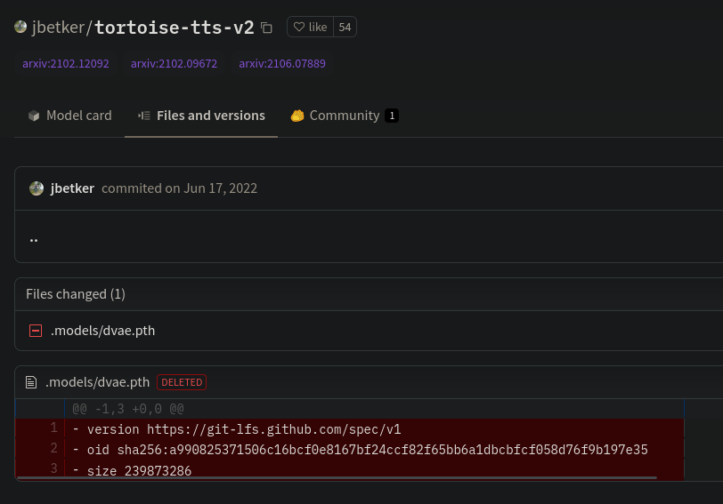

Five days ago, I published a blog post, describing [why TorToiSe could not be fine-tuned](https://152334h.github.io/blog/tortoise-fine-tuning/).

Today, I have released a [fork of DL-Art-School](https://github.com/152334H/DL-Art-School) with TorToiSe fine-tuning code. How did that happen?

<!--more-->

## The dVAE
The crux of the previous article was the missing model -- the **VQVAE**, or discrete-VAE (**dVAE**). Without it, it is impossible to train any part of the model other than the diffuser and the vocoder, which is not at all sufficient for voice emulation.

Approximately 8 hours before the time of writing, [I was informed](https://github.com/152334H/152334H.github.io/discussions/4#discussioncomment-4987081) of an incredible observation: that the dVAE checkpoint had actually once existed on the tortoise huggingface repository, before being purged:

This was, to put politely, a colossal mistake on the part of the :turtle: developer. git repositories track the _full history_ of the project, [**including deleted files**](https://huggingface.co/jbetker/tortoise-tts-v2/blob/301bf480e8e89caa694a58a3144d218f7d583fb0/.models/dvae.pth). The correct move would have been to delete the repository && reupload everything -- something I suspect he might take the agency to do now, when it is too late.

I refuse to believe that a developer of his caliber could've been unaware that git repositories store the histories of removed files, so I can only conclude he must've expected that no one intelligent enough to spot it would try to unleash fine-tuning code to the world.

In any case, the dVAE is now public. What can be done?

## Fine-tuning with DLAS

I spent the next 6 hours getting neonbjb's [Deep Learning Art School](https://github.com/neonbjb/DL-Art-School) project to run on my local hardware. In no particular order, the problems I faced were:
* model dimension mismatches. The VQVAE's cookbook_dim was defined [here](https://docs.google.com/document/d/13O_eyY65i6AkNrN_LdPhpUjGhyTNKYHvDrIvHnHe1GA), [here](http://web.archive.org/web/20230125205033/https://github.com/neonbjb/tortoise-tts/issues/200), [here](http://web.archive.org/web/20230213182200/https://github.com/neonbjb/tortoise-tts/issues/92#issuecomment-1149023261), and in a lot of other places as `cookbook_dim=256`. The `dvae.pth` checkpoint has a cookbook_dim of 512. I initially intepreted this as a sign that it was an experimental vqvae that would fail to train well, but I proved that wrong about an hour ago, so I'm a bit lost. "Every single last piece of public documentation was wrong" sounds like an unlikely mistake.
* `UnifiedVoice`. I copied the AR model configs from [here](http://web.archive.org/web/20230216033901/https://github.com/neonbjb/DL-Art-School/issues/8) and spliced them together with the longer VQVAE config defined above, and the parameters were _mostly_ fine. The mismatches came in dealing with the specific kwargs for the UnifiedVoice class, or more specifically, the **[three](https://github.com/neonbjb/DL-Art-School/blob/master/codes/models/audio/tts/unified_voice4.py) [separate](https://github.com/neonbjb/DL-Art-School/blob/master/codes/models/audio/tts/unified_voice3.py) [definitions](https://github.com/neonbjb/DL-Art-School/blob/master/codes/models/audio/tts/unified_voice2.py)** of it, all of which were incompatible with the actual [tortoise-tts repo's](https://github.com/neonbjb/tortoise-tts/blob/main/tortoise/models/autoregressive.py) definition. I eventually realised that `types=1` was equivalent to a no-op in all unifiedvoice configs, which let me work with the uv2 definition.
* installation issues. There were some dynamic import errors with CLIP that I made a commit to patch. Dependency hell with the old requirements file. Expected hardcoded experiment files that were missing. Doesn't matter, I fixed them in the fork.
* hyperparameter tuning. I say tuning, but what I really did was to make a few lucky guesses that worked out.

The repo is [here](https://github.com/152334H/DL-Art-School), if you want to see it. There are test samples on the page.

